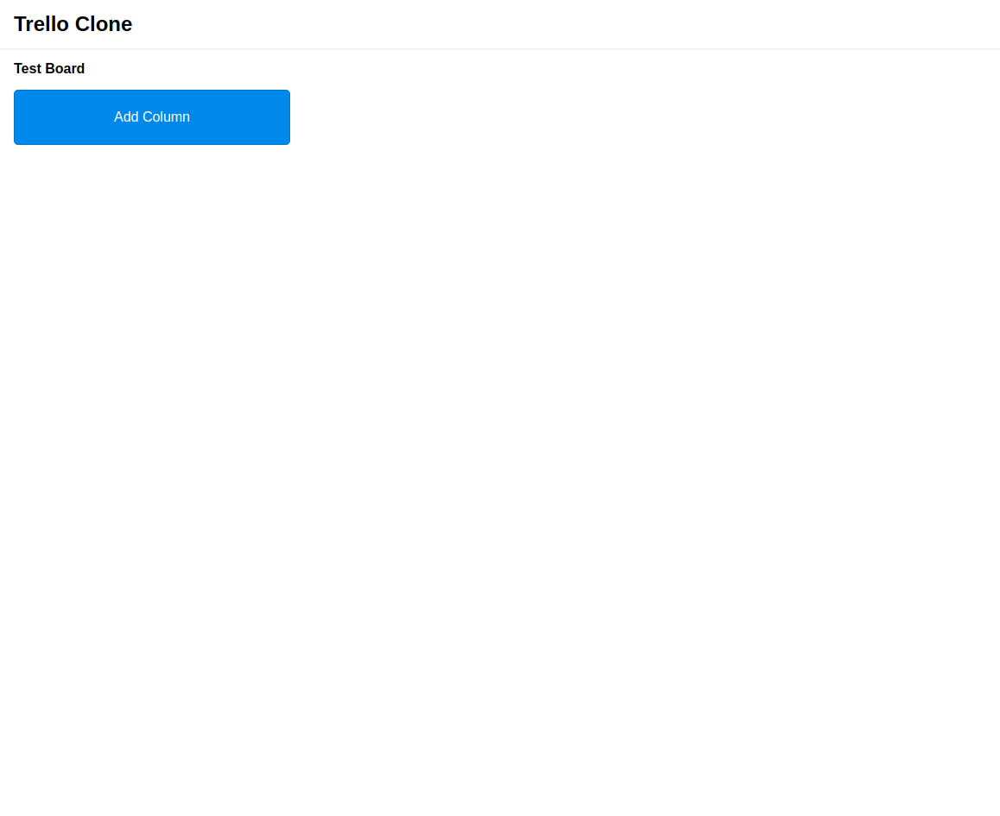

A responsive clone of Trello.

## Requirements

The requirements of the project was:

- A user should be able to add and label columns.
- A user should be able to add and edit cards.
- A user should be able to move cards between columns
- The App's state should be persisted between refreshes

## Concideration

For Implementing the project I concidered:

- Writing test for the main context
- Using emotion for styling

## Folder structure

The top level folder structure is:

    .
    ├── build     # Bundled files after building the project
    ├── public    # Static files that will be copied directly into build folder
    ├── src       # Source files
    └── README.md

The Structure of `src` folder is:

    .
    ├── ...
    ├── src
    │   ├── @types          # Shared types
    │   ├── components
    │   ├── context
    │   ├── hooks
    │   ├── styles          # Shared style related files
    │   └── utils           # Pure utility functions
    └── ...

**Each folder can contains the same structure inside itself.** for example:

    .
    ├── ...
    ├── src
    │   ├── components
    │   │   ├── Card
    │   │   │  │── index.tsx
    │   │   │  │── components   # Components folder can appear again
    │   │   └── ...
    │   └── ...
    └── ...

## Run Project

To Run the project in development mode,

using `yarn`:

```bash
$ yarn start
```

using `npm`:

```bash
$ npm run start
```

## Test Project

To Run the project's tests,

using `yarn`:

```bash
$ yarn test
```

using `npm`:

```bash
$ npm run test
```

To run the tests in watchmode:

using `yarn`:

```bash
$ yarn test:watch
```

using `npm`:

```bash
$ npm run test:watch
```

## Build Project

To build the project for production

using `yarn`:

```bash
$ yarn build
```

using `npm`:

```bash
$ npm run build
```

The script will build the app for production into the `build` folder.

It correctly bundles React in production mode and optimizes the build for the best performance

The build is minified and the filenames include the hashes.

You can serve the `build` folder using any static serving tool e.g. `live-server`

## Potential Further Imporvments

If I had more time, I would add the following featurs to the product side:

- A user entity, so that cards can be assigned to different users.
- Label/Tag for cards
- Implement different filters to find a card easier

on technichal side:

- Add more unit tests
- Test main flows with e2e testing tools
- Sync the app's state on different tabs of the browser
- Add more breakpoints and adjust style's variable based on them
- Improve error handling and add error traking services

## Screenshots




